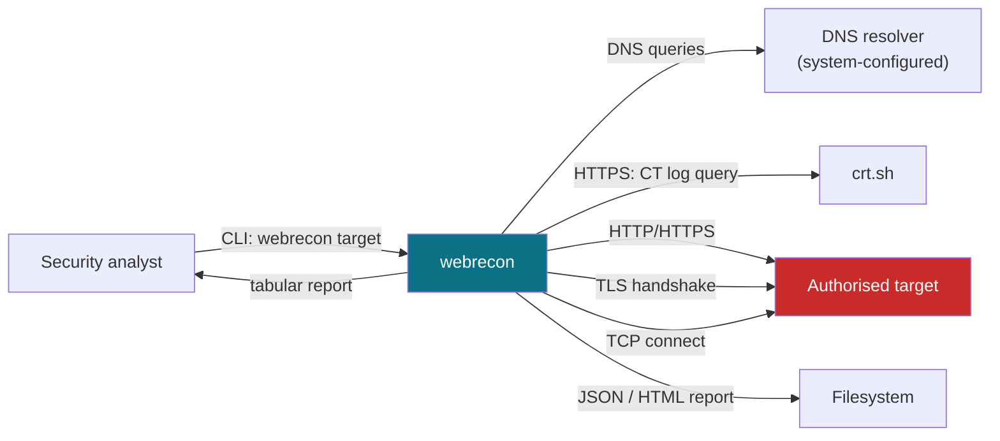
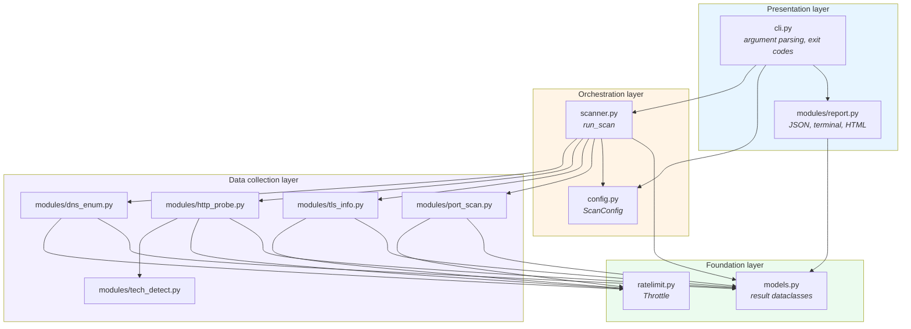
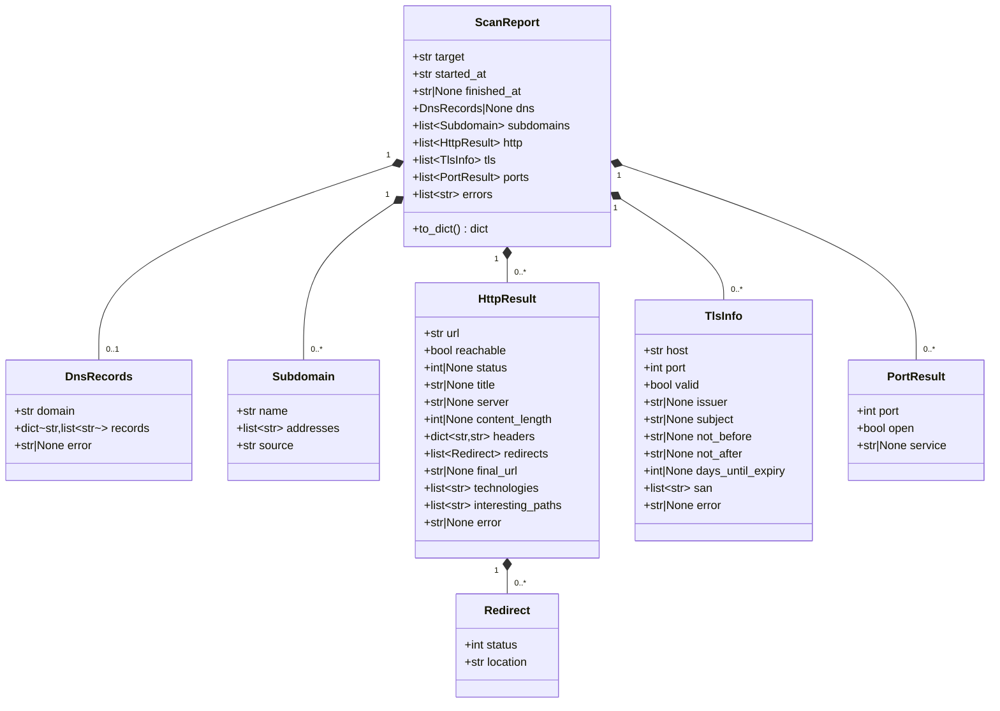
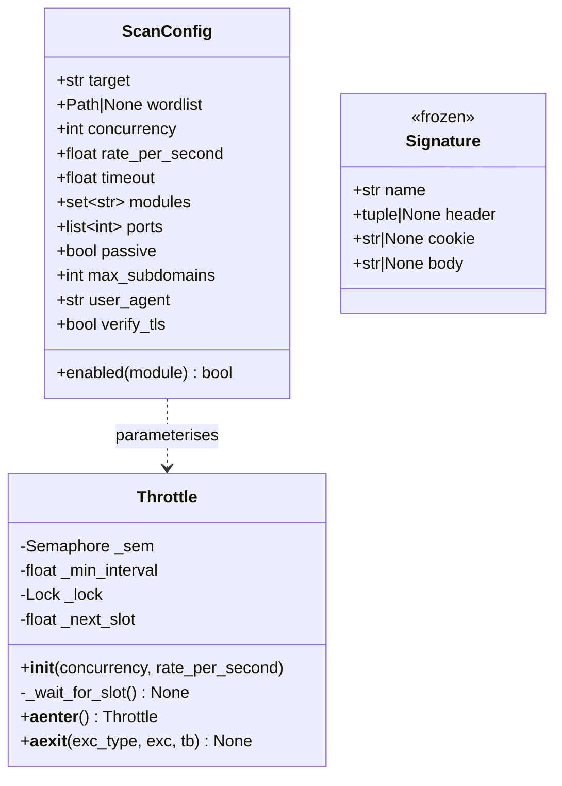
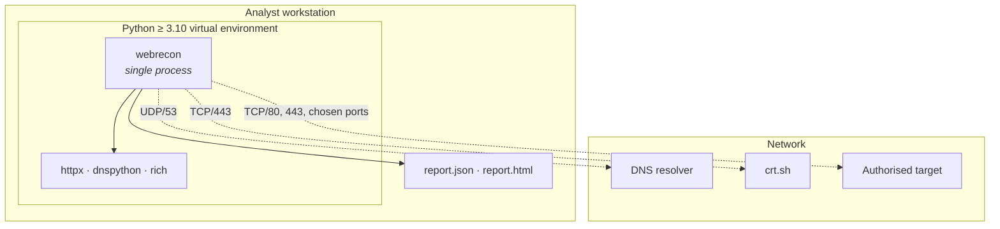

# 1. System architecture

| | |
| --- | --- |
| Document | SDD-01 — Architectural view |
| System | webrecon 0.1.0 |
| Status | Approved |
| Last revised | 2026-07-27 |

## 1.1 Purpose

This document describes the static structure of webrecon: the division into
packages, the dependencies between components, the data model, and the
architectural decisions that constrain the implementation. Runtime behaviour is
covered in [04-runtime-behaviour.md](04-runtime-behaviour.md); the
function-by-function detail in
[03-function-reference.md](03-function-reference.md).

## 1.2 Context view

webrecon is a single-process command line application. It exposes no services,
persists no state between runs, and requires no root privileges.

The target is the only third-party system contacted actively, which is why it
is highlighted: every interaction with it requires prior written authorisation
(see [02-use-cases.md §2.6](02-use-cases.md#26-legitimacy-constraints)).

## 1.3 Package view

**Dependency rule.** Arrows always point downwards: a layer may depend on the
layers below it, never on its own or on those above. In particular no
collection module knows about `report.py` or `cli.py`, which makes every module
usable as a library independently of the CLI.

### 1.3.1 Responsibilities per file

| File | Responsibility | Depends on |
| --- | --- | --- |
| [`webrecon/__init__.py`](../webrecon/__init__.py) | Exposes `__version__` | — |
| [`webrecon/__main__.py`](../webrecon/__main__.py) | Entry point for `python -m webrecon` | `cli` |
| [`webrecon/cli.py`](../webrecon/cli.py) | Argument parsing and validation, `ScanConfig` construction, output selection, exit codes | `config`, `scanner`, `modules.report` |
| [`webrecon/config.py`](../webrecon/config.py) | Execution parameters, immutable for the duration of a scan | — |
| [`webrecon/models.py`](../webrecon/models.py) | Shared result types and serialisation | — |
| [`webrecon/ratelimit.py`](../webrecon/ratelimit.py) | Concurrency and request pacing control | — |
| [`webrecon/scanner.py`](../webrecon/scanner.py) | Phase sequencing, host propagation between modules, report assembly | all modules, `config`, `models` |
| [`webrecon/modules/dns_enum.py`](../webrecon/modules/dns_enum.py) | DNS records, passive and active subdomain discovery | `ratelimit`, `models`, `config` |
| [`webrecon/modules/http_probe.py`](../webrecon/modules/http_probe.py) | HTTP probing, redirect chain, content discovery | `ratelimit`, `models`, `tech_detect` |
| [`webrecon/modules/tech_detect.py`](../webrecon/modules/tech_detect.py) | Signature-based technology fingerprinting | — |
| [`webrecon/modules/tls_info.py`](../webrecon/modules/tls_info.py) | X.509 certificate inspection | `ratelimit`, `models` |
| [`webrecon/modules/port_scan.py`](../webrecon/modules/port_scan.py) | TCP connect scanning | `ratelimit`, `models` |
| [`webrecon/modules/report.py`](../webrecon/modules/report.py) | JSON, terminal and HTML rendering | `models` |

## 1.4 Data model

Every module returns the dataclasses defined in `models.py`. No module returns
raw dictionaries: the conversion to dictionaries happens exactly once, in
`ScanReport.to_dict()`, immediately before serialisation.

The filled diamond denotes composition: each result lives exactly as long as
the `ScanReport` that contains it, and recursive serialisation through
`dataclasses.asdict` depends on that.

### 1.4.1 Configuration and infrastructure

`Throttle` implements the async context manager protocol; `Signature` is frozen
because signatures are module-level constants shared across all concurrent
calls.

## 1.5 Architectural decisions

### ADR-01 — Asynchronous concurrency with mandatory throttling

**Context.** Scanning is dominated by network latency: hundreds of independent
requests, each idle for most of its lifetime.

**Decision.** All I/O code is `asyncio`, and every outbound call passes through
a `Throttle` instance, which combines a semaphore (how many requests in flight)
with a token bucket (how many requests per second).

**Consequences.** Throughput stays high without the tool being able to degrade
into a denial of service. The cost is that modules cannot use blocking
synchronous libraries; where that is unavoidable (the `ssl` TLS handshake), the
call is delegated to a thread with `asyncio.to_thread`.

### ADR-02 — Typed contract between modules and presentation

**Context.** With modules returning free-form dictionaries, the report layer has
to guess at the schema and the JSON output becomes unstable.

**Decision.** Every module returns dataclasses from `models.py`.

**Consequences.** The JSON schema is determined by the dataclass definitions, so
it is versionable and verifiable by tests. Adding a field requires touching
`models.py`, which makes the change explicit at review time.

### ADR-03 — Partial failure rather than total failure

**Context.** In a real scan some portion of the targets is always unreachable,
slow, or misconfigured.

**Decision.** Every module catches the expected exceptions and records them in
the `error` field of its own result, or in `ScanReport.errors`. `run_scan` does
not raise on network failures.

**Consequences.** The user always gets a report, possibly partial. The flip side
is that a systematic failure (an unreachable DNS resolver, say) surfaces as an
empty result: this is why `fetch_records` explicitly populates `error` when it
resolves no records at all.

### ADR-04 — TLS verification disabled on purpose

**Context.** An expired certificate, or one with the wrong hostname, is exactly
the kind of finding the scan is meant to produce.

**Decision.** `ScanConfig.verify_tls` is `False` for HTTP probes, and
`tls_info._fetch_certificate` retries without verification when the verified
handshake fails.

**Consequences.** The tool observes and reports hosts a normal client would
refuse. Since webrecon transmits neither credentials nor sensitive data to the
target, the interception risk is acceptable for this use case.

### ADR-05 — Candidate truncation by confidence

**Context.** `--max-subdomains` caps the number of DNS resolutions. Alphabetical
truncation silently drops the apex domain and any passively discovered names
that sort late.

**Decision.** `select_candidates` orders by source (target, then `crt.sh`, then
wordlist) and only then applies the limit.

**Consequences.** Under a tight cap, the hosts most likely to exist survive.
Regression covered by three dedicated tests.

## 1.6 Deployment view

There are no databases, background services or shared state: every run is
self-contained and repeatable.

## 1.7 Non-functional requirements

| Requirement | How it is met | Verification |
| --- | --- | --- |
| The tool must not degrade the target's service | `Throttle` on every call; `--rate` and `--concurrency` | `tests/test_ratelimit.py` |
| A network failure must not abort the scan | Per-module exception handling | `tests/test_scanner.py::test_records_a_dns_failure_without_aborting` |
| JSON output must be stable and machine-readable | Typed dataclasses, `asdict` | `tests/test_report.py::TestJson` |
| The HTML report must not introduce XSS | `html.escape` on every cell | `tests/test_report.py::test_escapes_html_in_page_titles` |
| The test suite must run without network access | Pure-logic tests, stubbed modules | 84 tests, 0.4 s |
| Portability | Python 3.10–3.13, standard library plus three dependencies | CI matrix |
