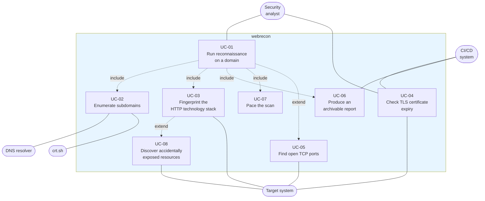

# 2. Use cases

| | |
| --- | --- |
| Document | SDD-02 — Use case specification |
| System | webrecon 0.1.0 |
| Status | Approved |
| Last revised | 2026-07-27 |

## 2.1 Actors

| Actor | Type | Description |
| --- | --- | --- |
| Security analyst | Primary, human | Runs the scan from the command line and interprets the report. Holds written authorisation to test the target. |
| CI/CD system | Primary, automated | Invokes webrecon non-interactively (`-q -o report.json`) to monitor exposed surface or certificate expiry. |
| DNS resolver | Secondary | The resolution service configured in the operating system. |
| crt.sh | Secondary | Public Certificate Transparency log aggregator, queried read-only. |
| Target system | Secondary | The host under reconnaissance. |

## 2.2 Use case diagram



`include` relationships denote behaviour always executed as part of the base
case; `extend` relationships denote conditional behaviour, triggered either by
an option (`-m ports`) or by a condition encountered during execution (an
exposed file being present).

## 2.3 Traceability matrix

| Use case | Realised by | CLI option | Tests |
| --- | --- | --- | --- |
| UC-01 | `scanner.run_scan` | base command | `tests/test_scanner.py` |
| UC-02 | `dns_enum.enumerate_subdomains` | `-m subdomains`, `-w`, `--no-passive` | `TestParseCrtsh`, `TestSelectCandidates` |
| UC-03 | `http_probe.probe_hosts`, `tech_detect.detect` | `-m http` | `TestTechDetect`, `TestExtractTitle` |
| UC-04 | `tls_info.inspect_hosts` | `-m tls` | `TestParseCertificate` |
| UC-05 | `port_scan.scan` | `-m ports`, `-p` | — (pure I/O) |
| UC-06 | `report.write_json`, `report.write_html` | `-o`, `--html` | `TestJson`, `TestHtml` |
| UC-07 | `ratelimit.Throttle` | `-r`, `-c` | `tests/test_ratelimit.py` |
| UC-08 | `http_probe.discover_content` | implicit in `-m http` | `TestLooksLikeHit`, `TestParseRobots` |

---

## 2.4 Detailed specifications

### UC-01 — Run reconnaissance on a domain

| | |
| --- | --- |
| **Primary actor** | Security analyst |
| **Preconditions** | The analyst holds written authorisation to test the domain; webrecon is installed; the system has network connectivity. |
| **Postconditions** | A `ScanReport` with `finished_at` populated has been produced, displayed in the terminal and optionally written to file. |
| **Trigger** | `webrecon example.com` |

#### Main flow

1. The analyst invokes the command with the target domain.
2. The system normalises the target, stripping scheme, path and port.
3. The system validates the options and builds the scan configuration.
4. The system resolves the domain's DNS records.
5. The system enumerates subdomains (UC-02).
6. The system probes the resolved hosts over HTTP (UC-03).
7. The system inspects the TLS certificates of reachable hosts (UC-04).
8. The system records the finish time and renders the report (UC-06).

#### Alternative flows

| Id | Condition | Behaviour |
| --- | --- | --- |
| A1 | The domain resolves no records | `DnsRecords.error` is populated, the string is appended to `ScanReport.errors`, and the scan continues with the remaining modules. |
| A2 | Enumeration yields no subdomains | The system falls back to the apex domain as the only host to probe. |
| A3 | No host answers over HTTPS | The TLS probe falls back to the first host in the list, so an outcome is still reported. |
| A4 | The analyst interrupts with Ctrl-C | The system prints `interrupted` and exits with code 130, writing no report files. |
| A5 | A requested module does not exist | `resolve_modules` terminates execution listing the valid modules, before any network traffic. |

---

### UC-02 — Enumerate subdomains

| | |
| --- | --- |
| **Primary actor** | Security analyst |
| **Secondary actors** | crt.sh, DNS resolver |
| **Preconditions** | The `subdomains` module is enabled. |
| **Postconditions** | `ScanReport.subdomains` contains only hosts that actually resolve, each tagged with its source. |

#### Main flow

1. If passive mode is on, the system queries crt.sh for certificates issued on
   the domain.
2. The system normalises the returned names: lowercase, wildcards stripped,
   names outside the target domain discarded.
3. If a wordlist was supplied, the system generates `word.domain` candidates.
4. The system adds the apex domain to the candidate set.
5. The system orders candidates by source confidence and applies the
   `--max-subdomains` cap.
6. The system resolves the A and AAAA records of each candidate, respecting the
   throttle.
7. The system discards candidates that do not resolve and returns the rest in
   alphabetical order.

#### Alternative flows

| Id | Condition | Behaviour |
| --- | --- | --- |
| A1 | crt.sh does not answer, or answers with invalid JSON | The system proceeds with wordlist candidates alone; the failure is non-fatal. |
| A2 | The wordlist file does not exist | `cli.main` terminates before the scan with an explicit message. |
| A3 | Candidates exceed the cap | Survivors, in order: apex domain, crt.sh names, wordlist names. |
| A4 | A candidate resolves over IPv6 only | It is included normally; `addresses` holds only the AAAA addresses. |

---

### UC-03 — Fingerprint the HTTP technology stack

| | |
| --- | --- |
| **Primary actor** | Security analyst |
| **Preconditions** | At least one host is available to probe. |
| **Postconditions** | Each host has an `HttpResult` recording reachability and, when reachable, status, title, headers and detected technologies. |

#### Main flow

1. For each host the system attempts the request over HTTPS.
2. The system manually follows up to five redirects, recording the status and
   destination of each.
3. From the final response the system extracts status, final URL, title,
   `Server` header and content length.
4. The system matches headers, cookies and body against the technology
   signatures and collects the hits, without duplicates.
5. The system runs content discovery against the host (UC-08).

#### Alternative flows

| Id | Condition | Behaviour |
| --- | --- | --- |
| A1 | HTTPS fails | The system retries over HTTP; if that fails too it returns the HTTPS result, which carries the original error. |
| A2 | Redirects exceed the limit | `HttpResult.error` reports `too many redirects` and the host is marked unreachable. |
| A3 | The response exceeds 256 KB | The body is truncated before analysis; headers and status remain intact. |
| A4 | No signature matches | `technologies` stays empty: the system makes no claim it cannot evidence. |

---

### UC-04 — Check TLS certificate expiry

| | |
| --- | --- |
| **Primary actors** | Security analyst, CI/CD system |
| **Preconditions** | The `tls` module is enabled. |
| **Postconditions** | Issuer, subject, SANs, validity window and days remaining are available for each host. |

#### Main flow

1. The system selects the hosts that answered over HTTPS.
2. For each it opens a connection on port 443 and completes the handshake.
3. The system extracts the peer certificate and converts its fields.
4. The system computes the days remaining and marks the certificate valid if
   the expiry date is in the future.

#### Alternative flows

| Id | Condition | Behaviour |
| --- | --- | --- |
| A1 | The verified handshake fails (self-signed, expired, hostname mismatch) | The system retries without verification and reports the data anyway: the anomalous certificate is the finding, not an error to hide. |
| A2 | The host accepts no connection on 443 | `TlsInfo.error` records the system error; other hosts are unaffected. |
| A3 | A certificate date is not in the expected format | The raw value is preserved in `not_after` and the certificate is marked invalid, without raising. |
| A4 | The certificate expires within 15 days | Terminal rendering highlights the count in red. |

---

### UC-05 — Find open TCP ports

| | |
| --- | --- |
| **Primary actor** | Security analyst |
| **Preconditions** | The `ports` module is explicitly enabled (it is not part of the default profile). |
| **Postconditions** | `ScanReport.ports` lists only the open ports, sorted, each with its conventional service name. |

#### Main flow

1. The system parses the port specification, which accepts lists and ranges.
2. For each port it opens a full TCP connection within the timeout.
3. The system closes every successful connection cleanly.
4. The system returns only the ports whose connection succeeded.

#### Alternative flows

| Id | Condition | Behaviour |
| --- | --- | --- |
| A1 | The port specification is malformed or outside 1–65535 | `argparse` rejects the argument before the scan starts. |
| A2 | The connection times out or is refused | The port is treated as closed and omitted from the report. |

> This is a *connect* scan: it completes the handshake and is therefore fully
> recorded in the target's logs. That is the correct behaviour for a tool aimed
> at systems you are authorised to test.

---

### UC-06 — Produce an archivable report

| | |
| --- | --- |
| **Primary actors** | Security analyst, CI/CD system |
| **Postconditions** | The report is available in the requested formats; the exit code is 0. |

#### Main flow

1. At the end of the scan the system renders tables for the non-empty sections
   in the terminal.
2. If requested, it serialises the report to JSON using the dataclass schema.
3. If requested, it generates a self-contained HTML document with no external
   assets.
4. The system confirms the written paths on stderr.

#### Alternative flows

| Id | Condition | Behaviour |
| --- | --- | --- |
| A1 | Quiet mode is active | Terminal rendering is skipped; files are still written. |
| A2 | A section is empty | Its table is not emitted, neither in the terminal nor in HTML. |
| A3 | The target returns a title containing markup | The value is escaped before insertion into the HTML. |

---

### UC-07 — Pace the scan

| | |
| --- | --- |
| **Primary actor** | Security analyst |
| **Preconditions** | The target enforces traffic limits, or the rules of engagement prescribe a request ceiling. |
| **Postconditions** | At no point does the scan exceed the configured concurrency and rate. |

#### Main flow

1. The analyst specifies maximum concurrency and requests per second.
2. Every network call acquires a slot from the semaphore.
3. If a rate limit is active, the call waits for its turn in the token bucket
   before starting.
4. On completion, whether successful or not, the slot is released.

#### Alternative flows

| Id | Condition | Behaviour |
| --- | --- | --- |
| A1 | The rate is set to 0 | The token bucket is disabled; only the concurrency limit remains. |
| A2 | The call raises an exception | The slot is released regardless: the throttle cannot deadlock. |
| A3 | Parameters are out of range (concurrency < 1, rate < 0) | `Throttle` raises `ValueError` at construction. |

---

### UC-08 — Discover accidentally exposed resources

| | |
| --- | --- |
| **Primary actor** | Security analyst |
| **Type** | Extension of UC-03 |
| **Postconditions** | `HttpResult.interesting_paths` lists the paths that are actually present. |

#### Main flow

1. The system requests the well-known paths: `robots.txt`, `sitemap.xml`,
   `security.txt`, `.git/HEAD`, `.env`.
2. For each response with status 200 it verifies the body has the shape
   expected for that file type.
3. If `robots.txt` is present, it extracts its directives and reports their
   paths, up to a maximum of twenty.

#### Alternative flows

| Id | Condition | Behaviour |
| --- | --- | --- |
| A1 | The server answers 200 with an HTML error page (soft 404) | The shape check rejects the hit: a genuine `.git/HEAD` starts with `ref:`, a genuine `.env` contains `KEY=value` lines. |
| A2 | `robots.txt` contains only `Disallow: /` | No path is extracted: the value carries no information. |

> None of the requests in this use case is an exploit attempt: they are all GET
> requests to paths that servers either publish deliberately or leave readable
> through misconfiguration.

## 2.5 Operational scenarios

**Initial reconnaissance on an authorised perimeter.** The analyst runs the full
profile with a wordlist and produces both report formats, to be attached to the
engagement report.

```bash
webrecon example.com -m all -w wordlists/subdomains-small.txt \
    -r 10 -c 5 -o report.json --html report.html
```

**Continuous certificate monitoring.** A nightly pipeline runs the TLS module
alone in quiet mode and evaluates the days remaining with `jq`, flagging
certificates below a thirty-day threshold.

```bash
webrecon example.com -m tls -q -o tls.json
jq '.tls[] | select(.days_until_expiry < 30) | {host, days_until_expiry}' tls.json
```

**Verifying a reported exposure.** The analyst restricts the scan to the HTTP
module to confirm quickly whether a resource is publicly readable, without
generating additional DNS traffic.

```bash
webrecon app.example.com -m http -q -o exposure.json
```

## 2.6 Legitimacy constraints

Every use case that interacts with the target system carries, as a
non-negotiable precondition, the written authorisation of that system's owner.
Unauthorised scanning of third-party systems is a criminal offence in most
jurisdictions, including Italy (art. 615-*ter* of the penal code, unauthorised
access to a computer system). UC-02 in passive mode is the only use case that
queries public third-party sources exclusively, generating no traffic towards
the target at all.
