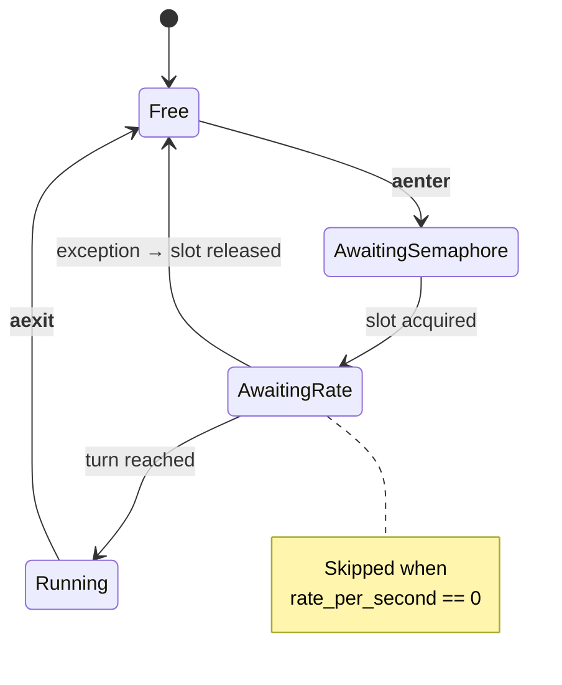
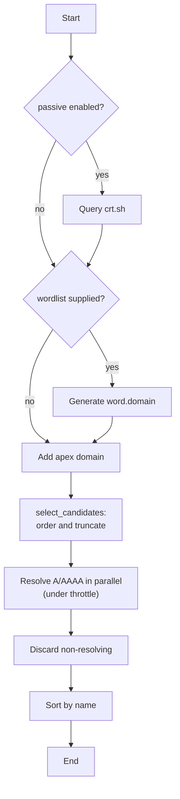
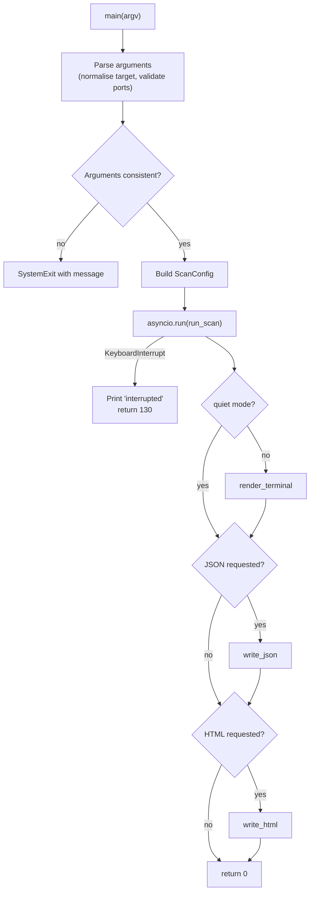

# 3. Function reference

| | |
| --- | --- |
| Document | SDD-03 — Detailed component specification |
| System | webrecon 0.1.0 |
| Status | Approved |
| Last revised | 2026-07-27 |

## 3.1 Purpose and conventions

This document describes every function, class and public constant in the
system: what it does, how it behaves at the edges, and which errors it handles.

Conventions used:

- Names beginning with `_` are private to their module and not part of the
  public interface: they are documented because they carry meaningful logic,
  but may change without notice.
- Functions marked **async** are coroutines and must be awaited.
- "Does not raise" means the expected errors (network, parsing) are caught and
  turned into return values; programming errors (`TypeError`, `AttributeError`)
  propagate normally.
- The test reference names the class covering that function in `tests/`.

## 3.2 Module map

```mermaid
graph LR
    subgraph pure["Pure logic (testable offline)"]
        P1["extract_title"]
        P2["parse_robots"]
        P3["parse_crtsh"]
        P4["load_wordlist"]
        P5["select_candidates"]
        P6["detect"]
        P7["parse_certificate"]
        P8["to_json / to_html"]
        P9["parse_ports / normalise_target"]
    end

    subgraph io["I/O logic (stubbed in tests)"]
        I1["fetch_records"]
        I2["enumerate_subdomains"]
        I3["probe_hosts"]
        I4["inspect_hosts"]
        I5["scan"]
    end

    io --> pure

    style pure fill:#ebfbee
    style io fill:#fff4e6
```

The separation is deliberate: decision logic is isolated in pure functions,
which is what lets 84 tests run without touching the network.

---

## 3.3 `webrecon/__init__.py`

The main package. Exposes only the `__version__` constant (currently `"0.1.0"`),
read from `pyproject.toml` at publish time. It imports no submodules, so
`import webrecon` stays fast and free of side effects.

## 3.4 `webrecon/__main__.py`

Entry point for `python -m webrecon`. Delegates entirely to `cli.main` and
propagates its return value as the process exit code. It exists alongside the
`webrecon` entry point declared in `pyproject.toml` so the tool can be run from
source without installation.

---

## 3.5 `webrecon/config.py`

### Configuration constants

| Name | Value | Role |
| --- | --- | --- |
| `DEFAULT_PORTS` | 15 common ports (21, 22, 25, 53, 80, 110, 143, 443, 445, 3306, 3389, 5432, 8000, 8080, 8443) | Default list for the `ports` module. Deliberately short: scanning the full port space is not an acceptable default behaviour. |
| `USER_AGENT` | `webrecon/0.1 (+project URL)` | Identifies the tool in the target's logs. Declaring your identity is part of conducting authorised reconnaissance properly. |

### `class ScanConfig`

Dataclass holding every parameter of a run. Built exactly once by `cli.main` and
passed by reference to the modules, none of which modify it.

| Field | Type | Default | Meaning |
| --- | --- | --- | --- |
| `target` | `str` | required | Already-normalised hostname. |
| `wordlist` | `Path \| None` | `None` | Wordlist for subdomain brute-force. |
| `concurrency` | `int` | `20` | Maximum simultaneous network operations. |
| `rate_per_second` | `float` | `0.0` | Ceiling on requests per second; `0` disables pacing. |
| `timeout` | `float` | `5.0` | Per-operation timeout, in seconds. |
| `modules` | `set[str]` | `{dns, subdomains, http, tls}` | Enabled modules. `ports` is excluded from the default profile. |
| `ports` | `list[int]` | `DEFAULT_PORTS` | Ports to scan. |
| `passive` | `bool` | `True` | Enables Certificate Transparency log queries. |
| `max_subdomains` | `int` | `200` | Cap on candidates resolved. |
| `user_agent` | `str` | `USER_AGENT` | `User-Agent` header on HTTP requests. |
| `verify_tls` | `bool` | `False` | Certificate verification on HTTP probes; disabled on purpose (ADR-04). |

#### `enabled(module: str) -> bool`

Reports whether a module is active for this run. The class's only method; it
exists so the orchestrator never inspects the `modules` set directly.

---

## 3.6 `webrecon/models.py`

Defines the data contract between the collection modules and the presentation
layer. All classes are behaviour-free dataclasses, except for
`ScanReport.to_dict`.

### `_utcnow() -> str`

Returns the current instant in UTC as ISO 8601 with second resolution. It is the
default factory for `ScanReport.started_at`. Using UTC explicitly prevents
reports produced in different time zones from being incomparable.

### Result dataclasses

| Class | Produced by | Contents |
| --- | --- | --- |
| `DnsRecords` | `dns_enum.fetch_records` | Domain, type → values map, optional error. The map holds only the types that returned at least one value. |
| `Subdomain` | `dns_enum.enumerate_subdomains` | Hostname, resolved addresses, discovery source (`target`, `crt.sh`, `bruteforce`). |
| `Redirect` | `http_probe.probe_url` | Status and destination of a single hop in the redirect chain. |
| `HttpResult` | `http_probe.probe_url` | Full probe outcome: reachability, status, title, headers, redirect chain, final URL, technologies, interesting paths, error. |
| `TlsInfo` | `tls_info.inspect` | Host, port, validity, issuer, subject, validity window, days remaining, SANs, error. |
| `PortResult` | `port_scan.check_port` | Port, open state, conventional service name. |
| `ScanReport` | `scanner.run_scan` | Aggregate of all the above, plus target, start and finish instants, and the list of scan-level errors. |

#### `ScanReport.to_dict() -> dict`

Recursively converts the whole report into native structures via
`dataclasses.asdict`. It is the single point where data leaves its typed form,
which makes the JSON schema a direct consequence of the definitions above.

**Edge behaviour.** A report with no results yields empty lists and `dns: null`,
never missing keys: automated consumers can rely on every field being present.

*Tests:* `tests/test_report.py::TestJson`

---

## 3.7 `webrecon/ratelimit.py`

### `class Throttle`

Combines a concurrency limit and a rate limit behind a single async context
manager interface. Every network call in the system passes through it.

#### `__init__(concurrency: int = 20, rate_per_second: float = 0.0)`

Constructs the throttle. The semaphore is sized to `concurrency`; the token
bucket computes a minimum interval of `1 / rate_per_second`, or zero when the
rate is unlimited.

**Errors.** Raises `ValueError` for `concurrency < 1` or `rate_per_second < 0`.
Validation happens at construction because a malformed throttle would render
every subsequent control meaningless.

#### `_wait_for_slot() -> None` *(private, async)*

Implements the token bucket. Under the lock it computes the next available slot
and advances it by the minimum interval; the actual wait happens **outside** the
lock, so subsequent coroutines can book their own turn without serialising on
someone else's wait.

Returns immediately when the rate limit is disabled.

#### `__aenter__() -> Throttle` *(async)*

Acquires a slot from the semaphore, then waits for its turn in the token bucket.
If the wait is interrupted (task cancellation, `KeyboardInterrupt`), it releases
the slot before propagating: the `except` clause catches `BaseException`
precisely to cover cancellation, which does not derive from `Exception`.

#### `__aexit__(exc_type, exc, tb) -> None` *(async)*

Releases the semaphore slot. It does not suppress exceptions: an error in the
block body keeps propagating to the caller, which is the module responsible for
that particular network call.

*Tests:* `tests/test_ratelimit.py::TestThrottle` — verifies peak concurrency,
effective rate, release on exception, and parameter validation.

---

## 3.8 `webrecon/modules/dns_enum.py`

### `dns_enum` constants

| Name | Role |
| --- | --- |
| `RECORD_TYPES` | The seven record types queried: A, AAAA, MX, NS, TXT, CNAME, SOA. |
| `CRT_SH_URL` | Endpoint of the Certificate Transparency service. |

### `_make_resolver(timeout: float)` *(private)*

Builds an async resolver setting both `timeout` (wait per attempt) and
`lifetime` (total wait). Setting only the former would leave the query free to
retry beyond the limit the user expects.

### `fetch_records(domain, timeout=5.0) -> DnsRecords` *(async)*

Queries all record types in parallel and aggregates the results.

**Behaviour.** Each type is queried by an independent coroutine; types that
return no values are omitted from the final map, so the report does not fill up
with empty keys. Values are sorted to keep output reproducible across runs.

**Error handling.** `NoAnswer`, `NXDOMAIN`, `NoNameservers`, `Timeout` and any
other `DNSException` are treated as "no value for this type". If no type
produced results, the `error` field is set to `"no DNS records resolved"`:
without it, a non-existent domain and a resolver outage would be
indistinguishable from an empty report.

### `_resolve_host(resolver, host, throttle) -> list[str]` *(private, async)*

Resolves a single host's A and AAAA records and returns the deduplicated, sorted
addresses. Both queries are wrapped in a single throttle block, so one host
consumes one slot rather than two.

Returns an empty list if the host does not resolve — the condition the caller
uses as an existence test.

### `load_wordlist(path: Path) -> list[str]`

Reads a wordlist of subdomain labels.

**Behaviour.** Lowercases, strips surrounding whitespace and dots, discards
blank lines and comments (`#`), and removes duplicates while preserving
first-appearance order. Reading uses `errors="ignore"`, because public
wordlists frequently contain invalid bytes that must not abort a whole scan.

*Tests:* `tests/test_parsing.py::TestLoadWordlist`

### `parse_crtsh(payload: str, domain: str) -> set[str]`

Extracts hostnames from a crt.sh JSON response.

**Behaviour.** A single `name_value` field may hold several newline-separated
names, and wildcard certificates appear as `*.example.com`: both cases are
normalised. Both `name_value` and `common_name` are considered. Names outside
the target domain are discarded — a certificate may list third-party domains,
which are not part of the authorised perimeter.

**Error handling.** Malformed JSON, or a payload that is not a list, yields an
empty set rather than an exception: the service is external and unreliable by
definition.

*Tests:* `tests/test_parsing.py::TestParseCrtsh`

### `passive_subdomains(domain, timeout=15.0) -> set[str]` *(async)*

Queries crt.sh and delegates parsing to `parse_crtsh`. The default timeout is
higher than elsewhere in the system because the service is notoriously slow on
heavily used domains. Any HTTP failure yields an empty set: passive discovery
is an enrichment, not a requirement.

### `select_candidates(candidates, domain, limit) -> list[str]`

Orders candidates by source confidence and applies the cap.

**Behaviour.** Sorting is by the pair (source priority, name), with priority
`target` < `crt.sh` < `bruteforce`. A non-positive limit returns the whole set.

**Rationale.** Plain alphabetical truncation silently drops the apex domain and
passively discovered names that sort late — precisely the hosts most likely to
exist (ADR-05).

*Tests:* `tests/test_parsing.py::TestSelectCandidates`

### `enumerate_subdomains(config: ScanConfig) -> list[Subdomain]` *(async)*

The module's orchestrator: merges the sources, selects candidates, resolves them
and returns only the hosts that exist.

The wordlist is skipped without error if the path does not exist, because
`cli.main` has already validated the file before starting the scan: the check
here is a safeguard for using the module as a library.

---

## 3.9 `webrecon/modules/http_probe.py`

### `http_probe` constants

| Name | Value | Role |
| --- | --- | --- |
| `TITLE_RE` | regular expression | Extracts the contents of `<title>`, with `DOTALL` for multi-line titles. |
| `MAX_BODY_BYTES` | 256,000 | Cap on body bytes analysed, to avoid consuming memory on huge responses. |
| `MAX_REDIRECTS` | 5 | Maximum hops followed before declaring a loop. |
| `COMMON_PATHS` | 5 paths | Resources checked by content discovery. |

### `extract_title(body: str) -> str | None`

Extracts an HTML page title.

**Behaviour.** Collapses internal whitespace (a title indented across three
lines becomes one line) and truncates at 200 characters. Returns `None` if the
tag is absent or holds only whitespace. Handles tags with attributes
(`<title dir="ltr">`).

*Tests:* `tests/test_parsing.py::TestExtractTitle`

### `parse_robots(body: str) -> list[str]`

Extracts the paths declared in a `robots.txt`.

**Behaviour.** Considers the `Disallow`, `Allow` and `Sitemap` directives,
ignoring comments and blank lines. Discards a bare `/`, which carries no
information, and deduplicates while preserving order.

**Security note.** A `robots.txt` is often an inadvertent index of the areas an
organisation considers sensitive: it is legitimate, public reconnaissance
material.

*Tests:* `tests/test_parsing.py::TestParseRobots`

### `_looks_like_hit(response, path) -> bool` *(private)*

Distinguishes a genuine hit from a soft 404.

**Behaviour.** Requires status 200 and a non-empty body, then applies a
shape check specific to the file type: a genuine `.git/HEAD` starts with `ref:`;
a genuine `.env` contains `KEY=value` lines; an `.xml` file contains markup; for
everything else, the presence of `<html` indicates a disguised error page.

**Rationale.** Many servers answer 200 with a custom error page. Without this
filter the report would flag files that do not exist as exposed — the most
damaging kind of finding in a security report.

*Tests:* `tests/test_parsing.py::TestLooksLikeHit`

### `probe_url(client, url, throttle, discover_paths=True) -> HttpResult` *(async)*

Probes a single URL, following the redirect chain manually.

**Behaviour.** Redirects are not delegated to `httpx` because the chain itself
is reconnaissance data: every hop is recorded as a `Redirect` with status and
destination, and relative destinations are resolved against the current URL.
From the final response it extracts status, final URL, title, `Server` header,
content length and detected technologies; if `content-length` is absent or
non-numeric, it falls back to the actual length of the downloaded body.

**Error handling.** Once the hop limit is exceeded, `error` reports
`too many redirects` and the host stays unreachable. Every `httpx.HTTPError`,
`UnicodeDecodeError` and `ValueError` is caught and recorded in `error` with its
type and message.

### `discover_content(client, base_url, throttle) -> list[str]` *(async)*

Checks the well-known paths on the host root, in parallel.

**Behaviour.** Rebuilds the root from the URL's scheme and authority, requests
the five paths concurrently, and filters the results through `_looks_like_hit`.
When `robots.txt` is present it expands its directives, adding up to twenty
paths prefixed with `robots:` so they are distinguishable in the output from
files found directly.

### `probe_hosts(hosts, config) -> list[HttpResult]` *(async)*

The module's entry point. Opens a single shared HTTP client and probes every
host.

**Behaviour.** For each host it tries HTTPS first; if unreachable it retries
over HTTP. If both fail it returns the HTTPS result, which preserves the
original error — more informative than the HTTP error on a host that only
speaks TLS. The client is configured with the project User-Agent, certificate
verification disabled (ADR-04), automatic redirects turned off, and a connection
limit aligned with the requested concurrency.

---

## 3.10 `webrecon/modules/tech_detect.py`

### `class Signature` *(frozen)*

Describes a single detection rule. A signature can match on a header (name plus
a regular expression over its value), on a cookie name, or on a regular
expression in the body. It is frozen because signatures are constants shared
across all concurrent calls.

### `SIGNATURES`

A tuple of 35 signatures detecting 28 distinct technologies: web servers
(nginx, Apache, IIS, Caddy, LiteSpeed), CDNs (Cloudflare, CloudFront, Fastly,
Varnish), application languages and frameworks (PHP, ASP.NET, Express, Next.js,
Nuxt, React, Vue, Angular, Django, Laravel, Flask, Rails), CMSs (WordPress,
Joomla, Drupal, Shopify) and front-end libraries (jQuery, Bootstrap, Google
Analytics).

Several signatures may point at the same technology through different evidence:
PHP is detectable both from the `X-Powered-By` header and from the `PHPSESSID`
cookie.

### `_cookie_names(headers) -> set[str]` *(private)*

Extracts cookie names from `Set-Cookie` headers, lowercased. Handles both
repeated headers (joined by `httpx` with newlines) and multiple comma-separated
cookies. A name counts as valid only when followed by `=`.

### `detect(headers, body="") -> list[str]`

Matches the response against all signatures and returns the detected
technologies, alphabetically sorted.

**Behaviour.** Header names are lowercased before matching, so detection is
case-insensitive. Each technology appears exactly once even when several
signatures match. Absent evidence, the list is empty: the module makes no
guesses.

**Known limits.** Detection relies on what the server declares. A target that
strips or forges application headers will not be identified — the correct
outcome for a tool that reports evidence rather than conjecture.

*Tests:* `tests/test_parsing.py::TestTechDetect`

---

## 3.11 `webrecon/modules/tls_info.py`

### `CERT_TIME_FORMAT`

The date format used in X.509 certificates as exposed by `ssl`
(`"%b %d %H:%M:%S %Y %Z"`, for example `Aug 29 21:41:26 2026 GMT`).

### `_flatten_name(name) -> str | None` *(private)*

Converts the nested tuple representation Python uses for X.500 names into a
readable string such as `countryName=US, organizationName=...`. Returns `None`
for an absent or empty name.

### `parse_certificate(cert, host, port) -> TlsInfo`

Converts the certificate dictionary into a `TlsInfo`, computing validity.

**Behaviour.** Flattens issuer and subject, extracts only the DNS-type SANs and
sorts them, and converts dates to ISO 8601. From the expiry date it computes the
days remaining and sets `valid` to true only if expiry is in the future.

**Error handling.** A date not matching the expected format is preserved in the
field as its raw value, without raising; the certificate stays marked invalid
because validity could not be demonstrated. A certificate with no fields yields
a `TlsInfo` with null values rather than an error.

*Tests:* `tests/test_report.py::TestParseCertificate`

### `_fetch_certificate(host, port, timeout) -> dict` *(private, blocking)*

Retrieves the peer certificate using a two-attempt strategy.

**Behaviour.** The first attempt uses full verification, because
`getpeercert()` returns the already-decoded dictionary only when verification
ran. If the verified handshake fails — self-signed, expired, or hostname
mismatch — the second attempt disables verification and retrieves the data
anyway.

**Rationale.** The anomalous certificate is exactly the finding the analyst
cares about: refusing the handshake would hide the most valuable information
(ADR-04).

Returns an empty dictionary if both attempts fail.

### `inspect(host, port=443, timeout=5.0, throttle=None) -> TlsInfo` *(async)*

Async wrapper around the blocking retrieval.

**Behaviour.** Delegates the handshake to a thread via `asyncio.to_thread`,
since the standard library's `ssl` module is synchronous; without that
delegation the entire event loop would block for the duration of the handshake.
If no throttle is passed, it creates one with unit concurrency.

**Error handling.** `OSError` and timeouts (unreachable host, closed port,
refused connection) are recorded in `error`. A successful but empty retrieval
yields the error `"no certificate retrieved"`.

### `inspect_hosts(hosts, timeout=5.0, concurrency=10) -> list[TlsInfo]` *(async)*

Inspects several hosts in parallel sharing a single throttle. The entry point
used by the orchestrator.

---

## 3.12 `webrecon/modules/port_scan.py`

### `COMMON_SERVICES`

Maps port number to conventional service name (18 entries). It is a convention,
not detection: port 3306 open is labelled `mysql` even if it hosts something
else. Actual service detection is on the roadmap.

### `check_port(host, port, timeout, throttle) -> PortResult` *(async)*

Attempts a full TCP connection to a port.

**Behaviour.** Opens the connection within the timeout and closes it cleanly,
awaiting `wait_closed()`. The close sits in a `finally` block and exceptions
during closing are suppressed: a connection that already dropped must not alter
the outcome of the check, which has already been determined.

**Error handling.** Timeouts and `OSError` (connection refused, host
unreachable) produce a result with `open=False`, never an exception.

### `scan(host, ports, timeout=3.0, concurrency=50) -> list[PortResult]` *(async)*

Scans the port list in parallel and returns only the open ports, sorted by
number. Default concurrency is higher than in the HTTP modules because a TCP
connection is far cheaper for the target than a full application request.

> **Technical note.** This is a *connect* scan, not a *stealth* scan: it
> completes the three-way handshake and is therefore fully recorded in the
> target's logs. That is the correct behaviour for a tool aimed at authorised
> systems, and it requires no root privileges.

---

## 3.13 `webrecon/modules/report.py`

### `to_json(report, indent=2) -> str`

Serialises the report to JSON. It does not sort keys, so field order mirrors the
dataclass definitions and diffs between two reports stay readable.

### `write_json(report, path) -> None`

Writes the JSON to a UTF-8 file. Overwrites without prompting: the path was
given explicitly by the user.

### `render_terminal(report, console=None) -> None`

Renders the report in the terminal using `rich`.

**Behaviour.** Emits a header panel with the target and execution instants,
followed by one table per **non-empty** section — sections without data are
omitted rather than shown empty. It applies interpretive colour coding: HTTP
status below 400 in green, otherwise yellow; certificates with fewer than
fifteen days remaining in red; errors in red. It accepts an injected console,
which makes the function testable.

*Tests:* `tests/test_report.py::TestTerminalRender`

### `to_html(report) -> str`

Generates a complete, self-contained HTML document.

**Behaviour.** Defines two inner functions: `esc`, which applies `html.escape`
to every value and substitutes `-` for empties, and `section`, which builds a
table only when it has rows. The CSS is inlined and there are no references to
external assets, so the file is readable offline and archivable as an appendix
to a report. The layout is responsive and adapts its colours to the system's
light or dark theme via `color-scheme`.

**Security.** Escaping is applied to every cell without exception. The data
comes from an untrusted system: a target page title may contain markup, and
without escaping the report itself would become an XSS vector against the
analyst who opens it. A dedicated test covers this case.

*Tests:* `tests/test_report.py::TestHtml`

### `write_html(report, path) -> None`

Writes the HTML document to a UTF-8 file.

---

## 3.14 `webrecon/scanner.py`

### `run_scan(config, on_stage=None) -> ScanReport` *(async)*

The module's only function: runs the enabled modules in sequence and assembles
the report.

**Behaviour.** Phases run in the order DNS → subdomains → HTTP → TLS → ports,
because each can feed the next. Specifically:

- the hosts probed over HTTP are the subdomains found; if enumeration produces
  nothing, it falls back to the apex domain;
- the hosts inspected over TLS are those that answered on HTTPS; if none did, it
  falls back to the first available host, so an outcome is reported rather than
  an empty section;
- the port scan always acts on the original target, not on the subdomains, so as
  not to multiply traffic across distinct hosts.

At the end it populates `finished_at`, which therefore doubles as the scan's
completion marker.

**The `on_stage` parameter.** An optional callback invoked with a short
description before each phase. It exists because the orchestrator must not know
about the terminal: the CLI passes a function that prints, the tests pass one
that accumulates into a list.

**Error handling.** A DNS failure is appended to `ScanReport.errors` and
execution continues. The function does not raise on network failures (ADR-03).

*Tests:* `tests/test_scanner.py::TestRunScan`

---

## 3.15 `webrecon/cli.py`

### CLI constants

| Name | Role |
| --- | --- |
| `ALL_MODULES` | Tuple of valid modules, used for validation and to expand `all`. |
| `BANNER` | Description shown by `--help`, stating the authorised purpose. |

### `parse_ports(value: str) -> list[int]`

Parses a port specification such as `80,443,8000-8100`.

**Behaviour.** Accepts single values and inclusive ranges, mixable in the same
specification. Deduplicates and sorts the result.

**Error handling.** Raises `argparse.ArgumentTypeError` for non-numeric values,
inverted ranges, an empty specification, or ports outside 1–65535. That
exception type is chosen because `argparse` turns it into a readable usage
message rather than a traceback, and validation happens before any traffic
starts.

*Tests:* `tests/test_cli.py::TestParsePorts`

### `normalise_target(value: str) -> str`

Reduces user input to a bare hostname.

**Behaviour.** Strips scheme, path, credentials and port, lowercases, and
removes a trailing dot. So `https://Example.COM:8443/admin` becomes
`example.com`. It is registered as the positional argument's `type`, so
normalisation happens during parsing and every downstream module receives an
already-clean hostname.

**Error handling.** Raises `argparse.ArgumentTypeError` on an empty target.

*Tests:* `tests/test_cli.py::TestNormaliseTarget`

### `build_parser() -> argparse.ArgumentParser`

Builds the parser with every option documented in the README. It is separate
from `main` so it can be tested in isolation, without running a scan. The
epilogue restates the authorisation constraint.

*Tests:* `tests/test_cli.py::TestParser`

### `resolve_modules(value: str) -> set[str]`

Translates the `--modules` string into the set of enabled modules.

**Behaviour.** The value `all` expands to the full tuple. Otherwise it splits on
commas, normalises, and checks that every name is valid.

**Error handling.** Raises `SystemExit` with a message listing the available
modules, both for unknown names and for an empty selection. The check precedes
the scan: a typo must not cost the user a full scan with an unexpected result.

*Tests:* `tests/test_cli.py::TestResolveModules`

### `main(argv=None) -> int`

The application entry point.

**Behaviour.** Validates the arguments `argparse` cannot check by itself
(concurrency at least one, wordlist file exists), builds the configuration, runs
the scan and produces the requested outputs. Progress and confirmation messages
go to **stderr** while the tabular report goes to stdout, so the report can be
redirected without diagnostics mixed in.

**Exit codes.**

| Code | Meaning | Source |
| --- | --- | --- |
| `0` | Scan completed; the report may be partial, with any errors listed inside it. | `main` return value |
| `1` | Precondition not met: unknown module, empty module selection, missing wordlist, concurrency below one. | `SystemExit` with message |
| `2` | Syntactically invalid arguments: malformed port, missing target, unknown option. | `argparse` |
| `130` | User interruption with Ctrl-C. | `KeyboardInterrupt` |

The absence of a "scan failed" code is consistent with ADR-03: a partial report
is a successful outcome, and any problems are described inside the report rather
than in a numeric code.
