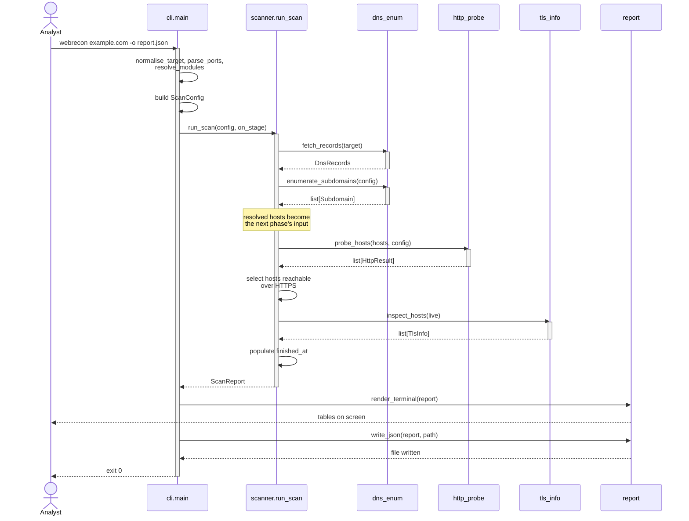
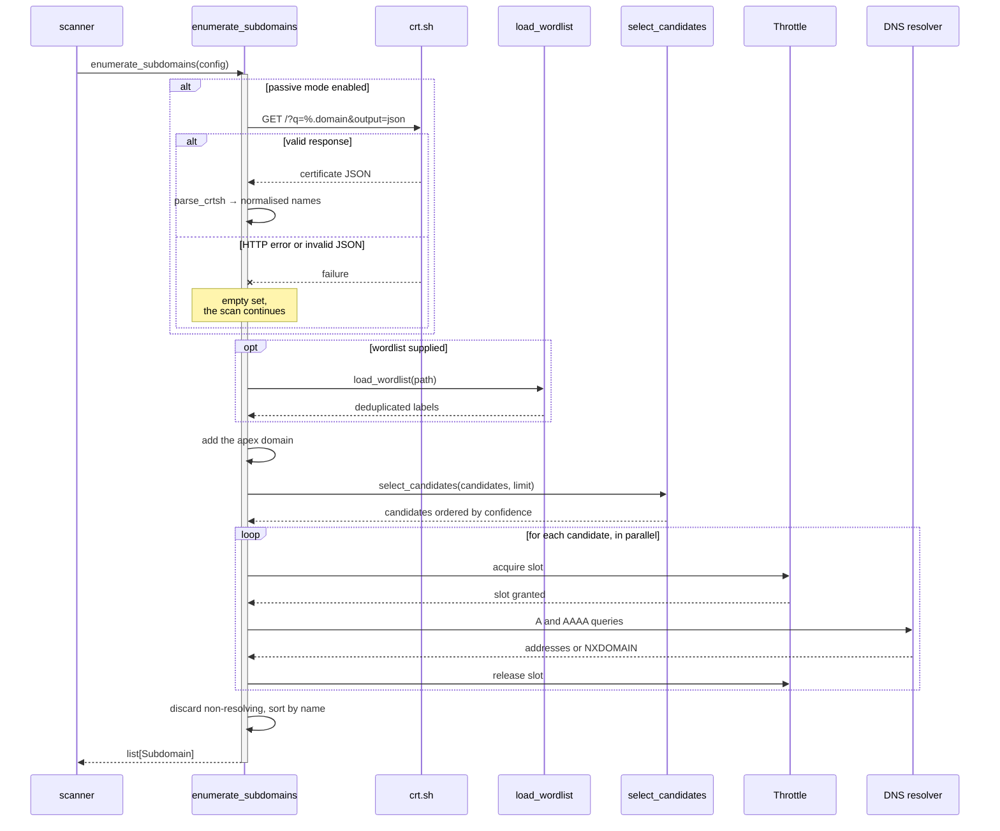
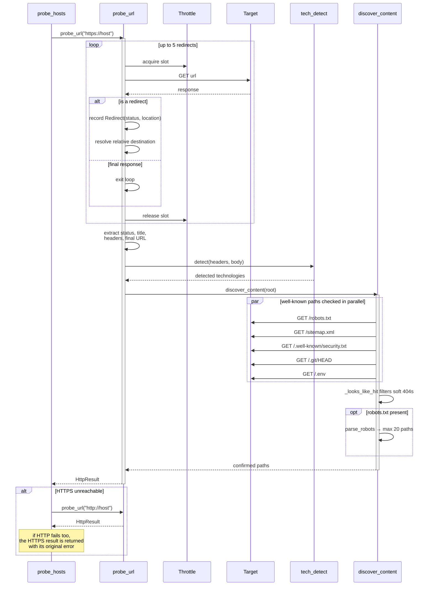
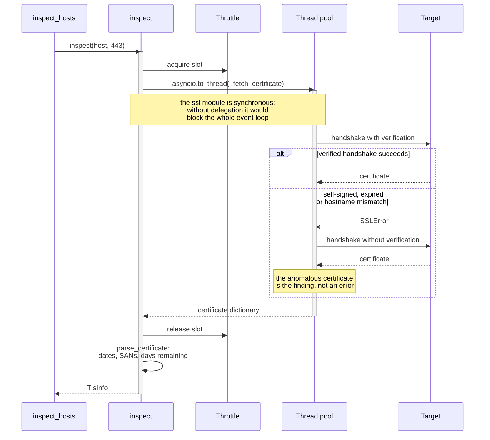
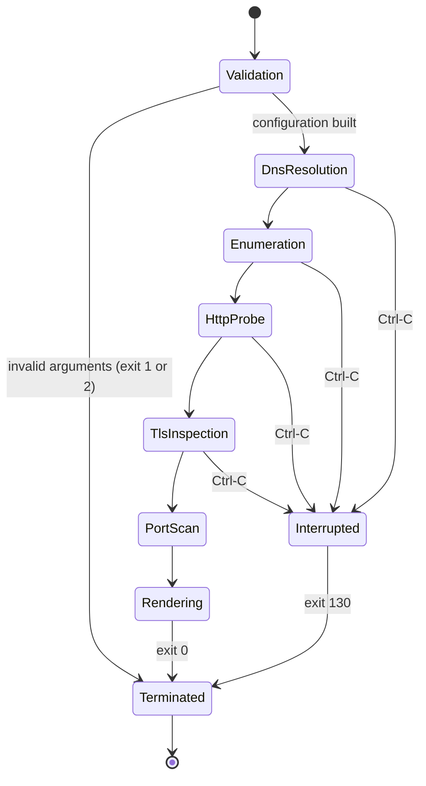
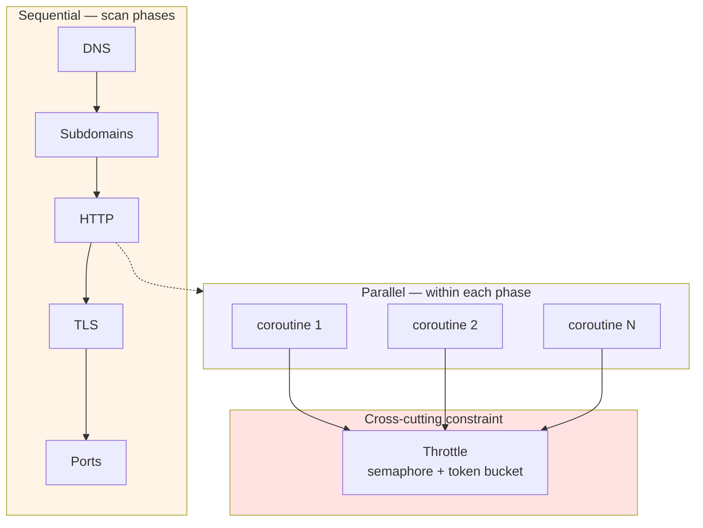
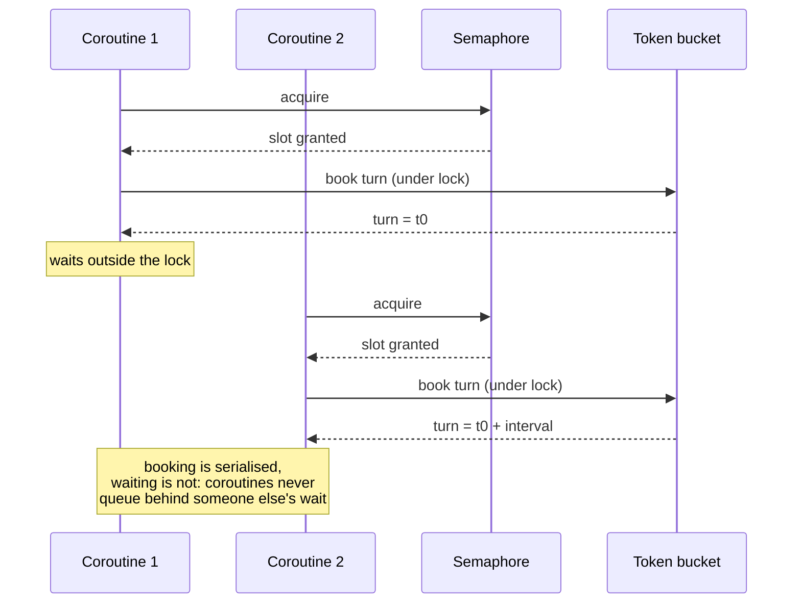
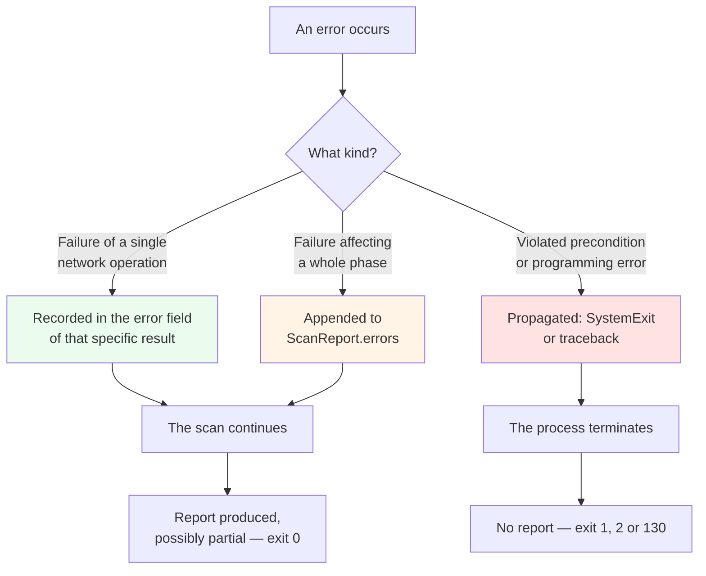
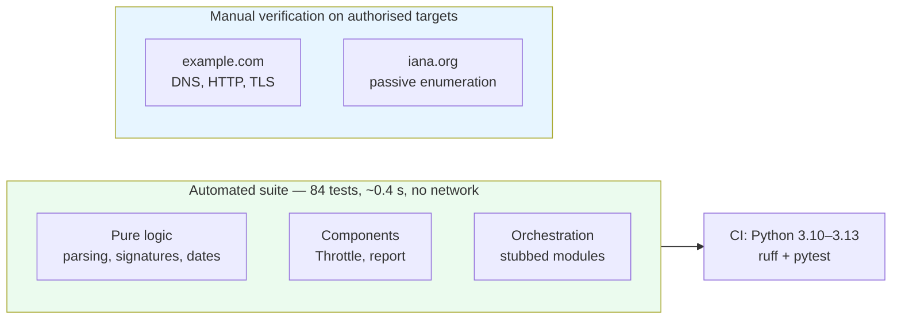

# 4. Runtime behaviour

| | |
| --- | --- |
| Document | SDD-04 — Dynamic view |
| System | webrecon 0.1.0 |
| Status | Approved |
| Last revised | 2026-07-27 |

## 4.1 Purpose

This document describes what happens at runtime: the sequence of interactions
between components, the scan lifecycle, error propagation, and the concurrency
model. The corresponding static structure is in
[01-architecture.md](01-architecture.md).

## 4.2 Overall scan sequence

The point worth noting is how hosts pass between phases: discovered subdomains
feed the HTTP probe, and only the hosts answering over HTTPS feed the TLS
inspection. Each phase narrows the set the next one works on, which contains
traffic towards the target.

## 4.3 Subdomain enumeration

## 4.4 HTTP probe with redirect chain

## 4.5 TLS inspection and thread delegation

## 4.6 Scan lifecycle

Every phase is entered even when its module is disabled: in that case it
produces no results and hands control straight to the next one. The
`Interrupted` state writes no report files.

## 4.7 Concurrency model

The system uses a single event loop in a single process. Parallelism is
cooperative and lives entirely within individual phases, never across them.

**Why phases stay sequential.** Each phase depends on the previous one's output:
without subdomains there is no way to know which hosts to probe, and without the
HTTP responses no way to know whose certificate to inspect. Parallelising them
would mean probing hosts not yet discovered.

**Why in-phase parallelism is bounded.** Every coroutine passes through the
`Throttle` before each outbound call. The semaphore limits how many requests are
in flight, the token bucket how many start per second. With `-c 5 -r 10` the
system never exceeds five simultaneous requests nor ten per second, however many
hosts are queued.

### Semaphore and token bucket interaction

The lock protects only the turn computation; the wait happens outside it. Were
the wait inside the lock, every coroutine would wait for the sum of all previous
waits and the effective rate would collapse.

## 4.8 Error propagation

The system distinguishes three levels of failure, with different destinations.

| Level | Examples | Destination | Effect |
| --- | --- | --- | --- |
| Operation | Unreachable host, HTTP timeout, port 443 closed, unreadable certificate | `HttpResult.error`, `TlsInfo.error` | That single result carries the error; other hosts are unaffected. |
| Phase | No DNS records resolved, crt.sh unreachable | `ScanReport.errors` or an empty set | The phase produces no data; later phases proceed on what is available. |
| Process | Non-existent module, missing wordlist, malformed ports, Ctrl-C | `SystemExit`, `KeyboardInterrupt` | The process terminates before or during the scan, writing no report. |

The third level's preconditions are checked **before** any network traffic
starts: a typo must not cost the user a full scan with an unexpected result.

## 4.9 Indicative timing profile

Measurements taken against `example.com` and `iana.org` from a home connection,
as an order of magnitude.

| Configuration | Hosts resolved | Duration |
| --- | --- | --- |
| `-m dns,http,tls --no-passive` | 1 | ~1 s |
| `-m subdomains` with a 138-entry wordlist and crt.sh | 15 | ~13 s |
| `-m ports` over 3 ports | 1 | ~1 s |

The dominant factor is the number of candidates to resolve, not the number of
enabled modules. With `--rate` set, the duration has a lower bound by
construction of the token bucket: `n` requests at `r` per second cannot complete
in less than `n / r` seconds.

## 4.10 Verification strategy

The automated suite makes no network calls: I/O functions are replaced by stubs
in `tests/test_scanner.py`, and everything else is pure logic. This keeps the
tests deterministic, runnable offline and free of traffic towards third-party
systems — a non-negotiable requirement for the CI of a security tool.
